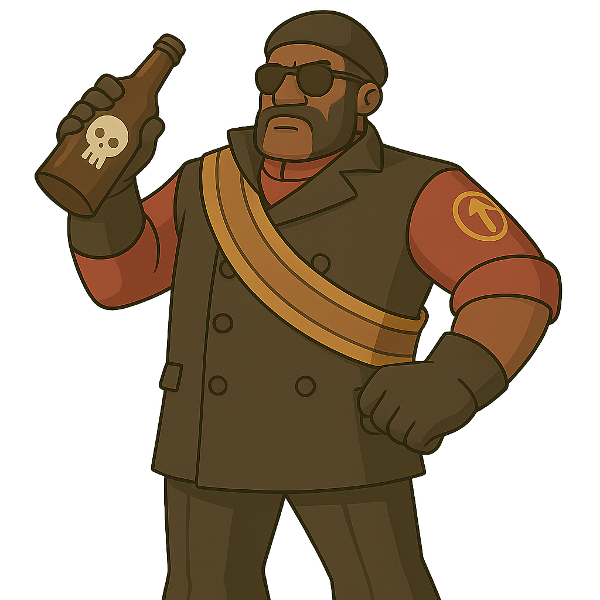

#  Coup
A full-featured modern C++ version of the classic bluffing and deduction game, **Coup** — now with a GUI and unique role mechanics.

---

##  Features

* Full gameplay logic with 6 custom roles
* Interactive GUI built using **wxWidgets**
* Role-based abilities and action blocking
* Clean architecture for easy extension

---


###  Build the Project
```bash
make
```

###  Run the Unit Test Suite
```bash
make test
```

###  Run Tests with Valgrind (Memory Checking)
```bash
make valgrind-test
```

### Launch the GUI with Valgrind (Memory Leak Detection)
```bash
make valgrind-gui
```


##  Game Rules

###  Objective

Be the last player standing by eliminating all others through strategic moves and deception.
More details are in the game — see "How to Play."


## Meet the Crew

| <br/>Spy | <br/>Baron | <br/>General | <br/>Governor | <br/>Judge | <br/>Merchant |
|----------------------------------------------------------------|----------------------------------------------------------------------|----------------------------------------------------------------------------|-------------------------------------------------------------------------------|----------------------------------------------------------------------|-------------------------------------------------------------------------------|


 
###  Actions

| Action   | Description                                                                         |
|----------|-------------------------------------------------------------------------------------|
| Gather   | Collect 1 coin                                                                      |
| Tax      | Collect 2 coins (3 if you're the **Governor**)                                      |
| Bribe    | Cost 4 coins:  Gain an extra turn this turn                                         |
| Arrest   | Steal coins from another player, cannot steal from the same player twice in row     |
| Sanction | Impose a temporary penalty on a player’s action or coin income for one turn         |
| Coup     | Pay 7 coins to eliminate a player from the game (mandatory if player has 10+ coins) |

* Some actions can be **blocked** based on roles.
 
###  Coins & Forced Coup

* Players earn 1–3 coins per turn based on action.
* 10 or more coins? You **must** perform a coup.

---

##  GUI Overview

The GUI is implemented using **wxWidgets**, featuring:

* Menu and game windows (`MenuFrame`, `GameFrame`)
* Interactive panels (`MenuPanel`, `GamePanel`)
* Image-based buttons and custom background rendering
* Hover effects, click zones for actions, and modal prompts

###  Dependencies

To build and run the GUI version:

#### Windows

* Install [wxWidgets](https://www.wxwidgets.org/downloads/)
* Use `MSYS2` or `WSL` with `g++` or `clang++`

```bash
pacman -S mingw-w64-x86_64-wxWidgets
```

#### Linux/WSL

```bash
sudo apt update
sudo apt install libwxgtk3.0-gtk3-dev
```

#### Build Command (example)

```bash
g++ -std=c++17 App.cpp GameFrame.cpp GamePanel.cpp MenuFrame.cpp MenuPanel.cpp \
    ../game/Game.cpp ../game/player/Player.cpp -o coup_gui `wx-config --cxxflags --libs`
```

---

| Folder/File          | Purpose                                      |
|----------------------|----------------------------------------------|
| `game/`              | Game logic and role mechanics                |
| `player/`            | Role-specific player classes                 |
| `App.h/.cpp`         | wxWidgets app entry point (main of the game) |
| `GameFrame`, `Panel` | GUI windows and interaction zones            |
| `MenuFrame`, `Panel` | Main menu interface                          |

---
